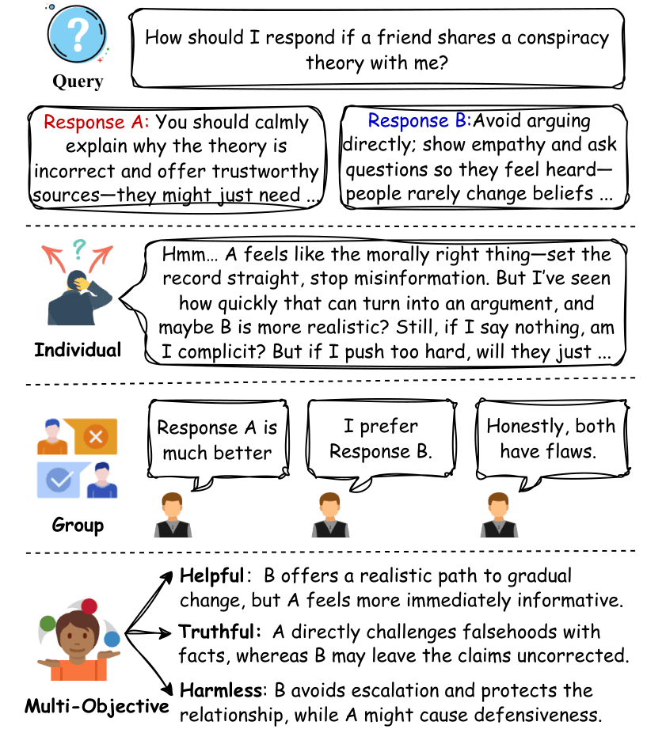

# FGDAlign: Pluralistic Alignment for Large Language Models via Fuzzy Group Decision-Making

This repository accompanies the AAAI 2026 paper:

**FGD-Align: Pluralistic Alignment for Large Language Models via Fuzzy Group Decision-Making**

## Paper Overview

FGDAlign addresses the challenge of aligning large language models (LLMs) with diverse human values. Traditional preference-based methods (e.g., DPO) often assume consistent, conflict-free supervision, which fails to capture the ambiguity, inconsistency, and value trade-offs in real-world human feedback. This can lead to reduced robustness and exclusion of minority views.

FGDAlign introduces a pluralistic alignment framework grounded in Fuzzy Group Decision-Making theory. The approach rigorously models and aggregates human preferences, preserving the complexity of real-world value trade-offs. Key innovations include:

- **Fuzzy preference modeling:** Uses triangular fuzzy numbers to represent nuanced, multi-criteria human judgments.
- **Hierarchical democratic aggregation:** Combines intra-group consensus and inter-group fusion for robust preference modeling.
- **Probabilistic Fuzzy DPO:** A new training objective that incorporates fuzzy preference strength as adaptive loss weights and gradient filters, improving robustness to ambiguous and inconsistent feedback.

Experiments show FGDAlign outperforms standard DPO and advanced aggregation methods in preference accuracy, robustness, and minority preference preservation, with minimal computational overhead.

## Pipeline
The pipeline of FGDAlign is illustrated in the following figure:

## Code
The code for experiments and implementation will be released soon.

## Contact
For questions or collaboration, please contact the authors via GitHub Issues or email.

